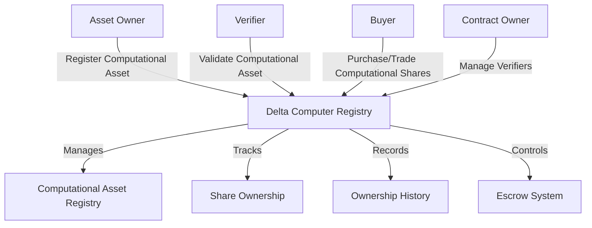

# Delta Computer: Computational Asset Tokenization

A revolutionary platform for tokenizing computational assets on the Stacks blockchain, enabling fractional ownership, transparent trading, and secure asset verification of computational resources.

## Overview

Delta Computer enables computational asset owners to create digital representations of unique computational resources like high-performance computing clusters, specialized hardware, quantum computing shares, and distributed computing networks. The platform supports:

- Comprehensive computational asset tokenization
- Fractional ownership of computing resources
- Verified asset registration through authorized technology partners
- Secure escrow-based trading of computational shares
- Royalty and platform fee management
- Detailed ownership history tracking

## Architecture

The system leverages a sophisticated smart contract for managing computational asset tokenization:



### Core Components

1. **Computational Asset Registry**: Stores tokenized computational asset information
2. **Share Management**: Handles fractional ownership of computing resources
3. **Verification System**: Manages authorized technology verifiers
4. **Trading Engine**: Facilitates secure computational asset transfers
5. **History Tracking**: Maintains comprehensive ownership records

## Contract Documentation

### Main Contract: delta-registry.clar

The main contract manages computational asset platform functionality:

#### Key Features

- Computational asset registration and management
- Fractional ownership of computational resources
- Verified asset tracking
- Escrow-based trading
- Ownership history recording
- Fee and royalty management

#### Access Control

- Contract Owner: Can manage verifiers and platform settings
- Asset Owners: Can modify their computational assets and initiate transfers
- Verifiers: Can validate registered computational resources
- General Users: Can purchase and trade computational shares

## Getting Started

### Prerequisites

- Clarinet
- Stacks wallet
- STX tokens for transactions

### Basic Usage

1. **Register a Computational Asset**:
```clarity
(contract-call? .delta-registry register-asset 
    "High-Performance GPU Cluster" 
    "Computational Hardware" 
    "Data Center, Silicon Valley" 
    value 
    is-fractional 
    total-shares 
    royalty-percent 
    "metadata-url")
```

2. **Verify a Computational Asset**:
```clarity
(contract-call? .delta-registry verify-asset asset-id)
```

3. **Transfer Computational Asset Shares**:
```clarity
(contract-call? .delta-registry transfer-shares asset-id recipient share-count)
```

## Function Reference

### Asset Management

```clarity
(register-asset description asset-type location valuation is-fractional total-shares royalty-percent metadata-url)
(update-asset-metadata asset-id description location valuation metadata-url)
(retire-asset asset-id)
```

### Trading Functions

```clarity
(create-asset-escrow asset-id buyer price expiration-blocks)
(create-shares-escrow asset-id buyer shares price expiration-blocks)
(complete-escrow escrow-id)
(cancel-escrow escrow-id)
```

### Ownership Management

```clarity
(transfer-asset asset-id recipient)
(transfer-shares asset-id recipient share-count)
```

## Development

### Testing

1. Clone the repository
2. Install Clarinet
3. Run tests:
```bash
clarinet test
```

### Local Development

1. Start Clarinet console:
```bash
clarinet console
```

2. Deploy contract:
```bash
clarinet deploy
```

## Security Considerations

### Asset Verification
- Only authorized technology partners can validate computational assets
- Verification status is permanent and immutable

### Trading Safety
- All computational asset trades use secure escrow
- Automatic fee and royalty calculations
- Built-in expiration for asset transfer transactions

### Ownership Protection
- Strict ownership checks for computational resources
- Asset locking during trading processes
- Prevention of double-allocation of computational shares

### Limitations
- Maximum of 1,000,000 shares per computational asset
- Maximum 50% royalty rate
- No direct STX refunds
- Locked assets cannot be transferred or modified

## Contributing

We welcome contributions from the computational asset and blockchain communities. Please review our contribution guidelines and code of conduct before submitting pull requests.

## License

[Insert appropriate open-source license]